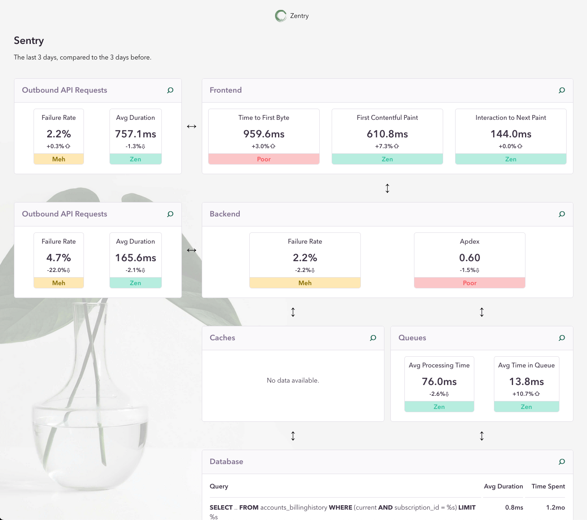

# Zentry

A Zen version of Sentry. 

Lets you see at a glance the areas in your system that need improvements.



Built by [Anton Pirker](https://github.com/antonpirker) during Sentry Hackweek 2024.

## Prerequisites

- You need to have Python installed (It was tested with Python 3.12)
- Access to a running Redis server.

## Configure

The app excepts the following environment variables to be set:

- `ZENTRY_REDIS_URL`

    An URL to a Redis server. This is used for caching HTTP requests made to the Sentry API.

    Default: `"redis://localhost:6379"`
    
- `SENTRY_API_AUTH_TOKEN`

    The User Auth Token that is used for connecting to the Sentry API. In Sentry.io click on your name in the top left corner and go to "User Settings" > "User Auth Tokens".

- `SENTRY_ORG_SLUG`

    The slug of the Sentry organization you want to retrieve data from. 

- `SENTRY_BACKEND_PROJECT_ID`

    The Sentry project ID of your backend.

- `SENTRY_BACKEND_ENVIRONMENT`

    The Sentry environment of your backend you want to monitor.

- `SENTRY_FRONTEND_PROJECT_ID`

    The Sentry project ID of your frontend.

- `SENTRY_FRONTEND_ENVIRONMENT`

    The Sentry environment of your backend you want to monitor.

- `SENTRY_DSN` (optional)  
    If you want to send error and performancne data of Zentry to Sentry give a DSN.


## Run

```bash
./run.sh
```

This will create a Python virtual environment, install all the requirements and run the app. 

Point your browser to: [http://localhost:5001](http://localhost:5001)
